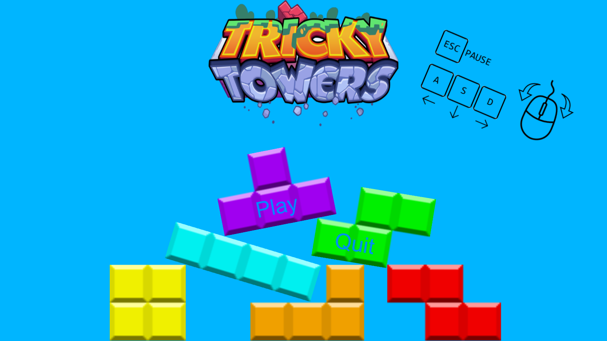
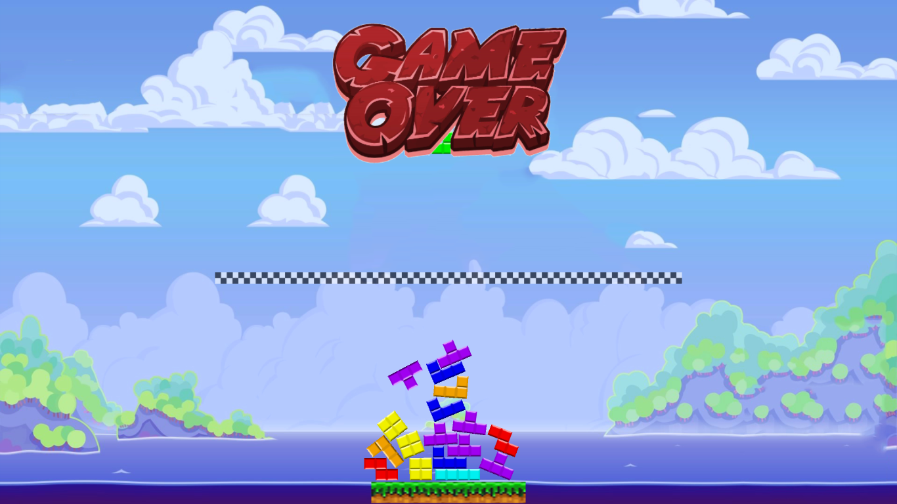
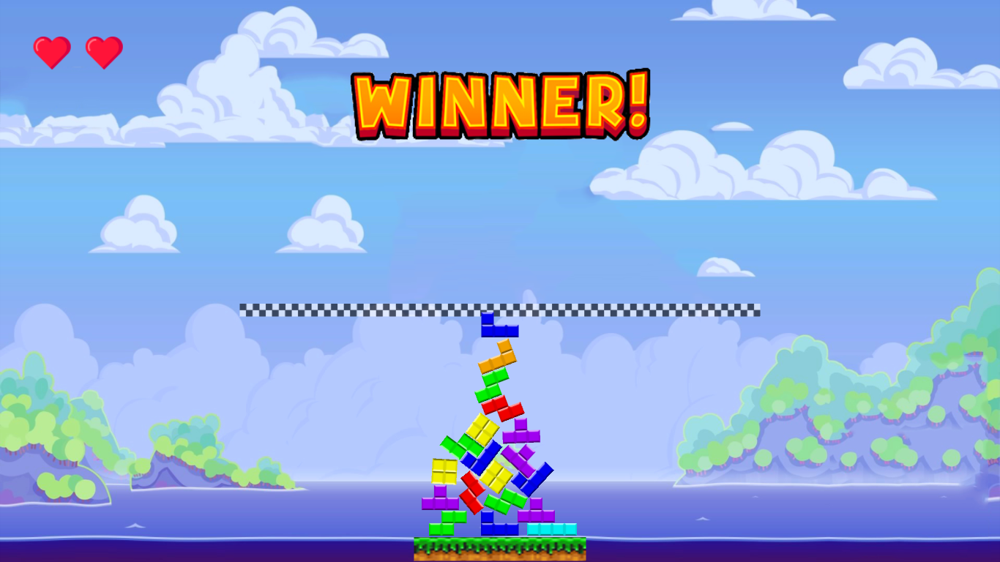

# TrickyTowersClone
Clone of Tricky Towers (with A LOT less features) made with Unity, a sort of Tetris but with physics 
My very first Unity project. Made with a small team of 4 people in may 2018 
Unity version: 2017.3.0f3

